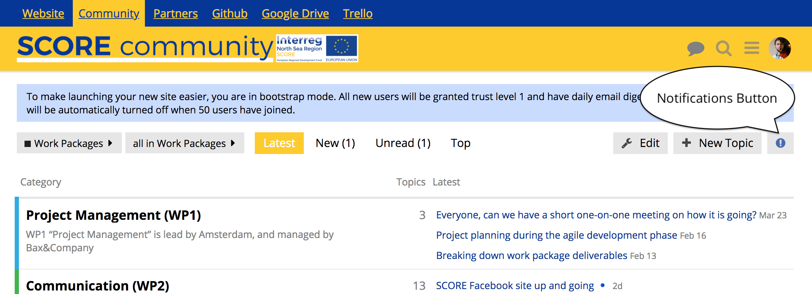
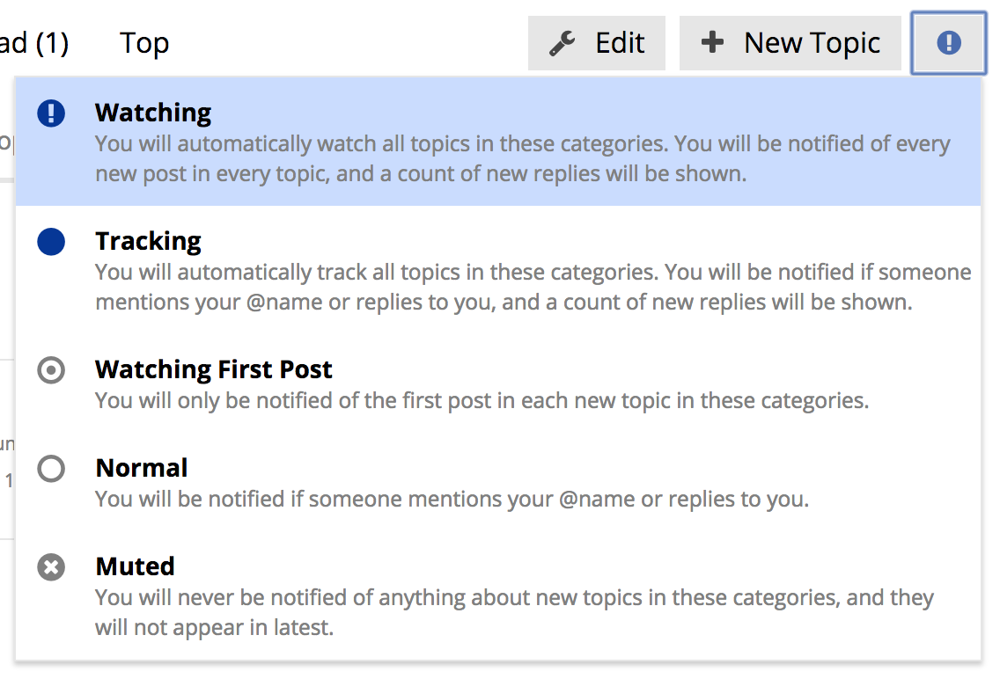

# Community: Take charge over your notifications

It is important to stay on top of the relevant converstations happening in the [SCORE.community](https://score.community), however you don't want to get notified by everything that happens and that is not that important. Luckily the community has a powerful notifications system that enables you to ganularly control what you get notified by and when.

This guide explains in practical terms how to make notifications work for you.

## The notification button

Every category and every topic has a Notifications button in the top right corner, it has a little round icon on it that is either grey or blue, depending on your notification settings. Click this button to open the menu that allows you to set a specific notification level for that category or topic.

Clicking the button will open a menu with your options.

## Notification options

The notification menu provides options ranging from 'Watching', for which you will be notified of everything that happens, to 'Muted' which means you will not receive any notifications, even if someone mentions you by name specifically.

We suggest going through the categories and setting the Notification options to what is relevant to you and what you are involved in.
